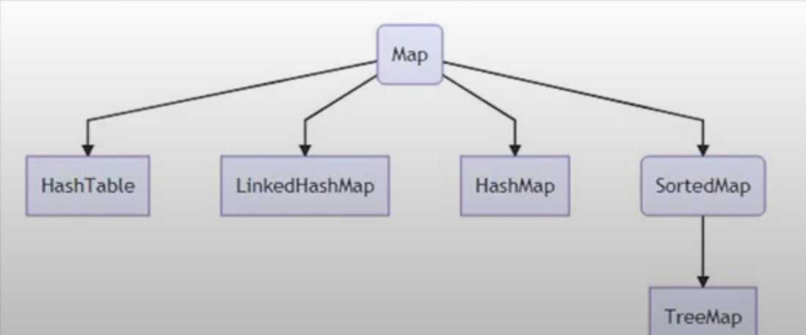
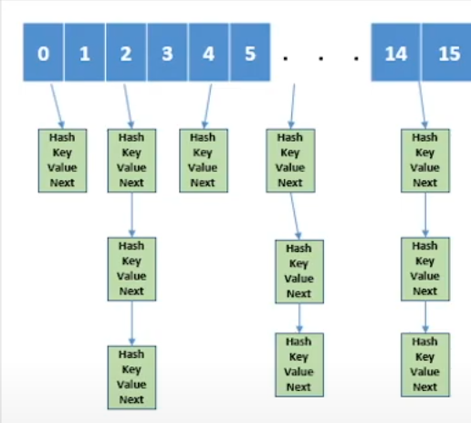

### <span style="color:BurlyWood">Коллекции - это группа элементов или контейнеров, представленных в виде единого целого.</span>


1. Любой класс, реализующий интерфейс java.lang.Collection
2. Классы, включенные в Collection Framework
3. Любой класс, задача которого содержать в себе ряд объектов другого класса

### <span style="color:BurlyWood">Что может делать коллекция?</span>

**Любая коллекция должна иметь возможность:**
1. Добавить новый элемент
2. Получить элемент
3. Удалить элемент
4. Проверить наличие элемента 
5. Перебрать элементы или пройтись по элементам 

**Более сложные операции:**
1. Слияние 2-х коллекций
2. Выделение части коллекции в качестве новой коллекции
3. Защита состояния при многопоточном исполнении

### <span style="color:BurlyWood">Что не могут коллекции?</span>
1. Работать с примитивами
2. Специализироваться в зависимости от типа данных

### <span style="color:BurlyWood">Зачем нужны коллекции?</span>
1. Уменьшение затрат времени при программировании
2. Улучшение производительности
3. Ускорение обучения
4. Взаимосвязь с другими частями приложения
5. Упрощение переноса кода

### <span style="color:BurlyWood">Реализация Коллекций в Java</span>
1. [x] Все коллекции в Java - это обобщения (Generics)
2. [x] Все коллекции реализуют ряд интерфейсов
3. [x] Коллекции вправе выбросить исключение типа java.lang.UnsupportedOperationException

### <span style="color:BurlyWood">Как работать с коллекцией?</span>
1. Понять, что нужно будет делать с коллекцией и это станет интерфейсом
2. Решить какая реализация подходит для задачи и это станет оъектом
```java
    Collection<Integer> collection = new LinkCollection<Integer>();
```
Где, 
```
Collection<Integer> ... - базовый интерфейс коллекции
new LinkCollection<Integer>() - реализация коллекции через связный список
``` 

**При создании методов нужно отталкиваться от интерфейсов:**
```java
    public void testFunction(List<Integer> list) throws UnsupportedOperationException {
        System.out.println();
    }
```
Здесь коллекция будет использоваться как список, но не обязательно указывать какой именно список: 
ArrayList, Vector или другой


### <span style="color:BurlyWood">Методы коллекции Списка(LIST):
1. ```add() - добавить элемент```
2. ```addAll() - добавление любой другой коллекции```
3. ```get() - получить элемент по индексу```
4. ```contains() - проверить содержание```
5. ```containsAll() - проверить содержание```
6. ```sublist() - получает индекс начала и конца и возвращает список```
7. ```toArray() - преобразует список в массив```
8. ```listIterator() - ListIterator в Java может проходить по списку в обоих направлениях, включая от конца к началу. Это одна из ключевых особенностей ListIterator, которая отличает его от обычного Iterator.```
9. ```remove() - удаляет элемент по индексу или по имени```
10. ```remove() - удаляет элемент по индексу или по имени```


```
Предупреждение Call to 'list. containsAll(collection)' may have poor performance связано с потенциально низкой 
производительностью вызова `containsAll()` в случае, если `firstList` является реализацией, где поиск элементов 
выполняется неэффективно, например, в `ArrayList`. Давайте разберемся, почему это важно.
```
### <span style="color:BurlyWood">Почему `containsAll()` может иметь низкую производительность? </span>

Метод `containsAll(Collection<?> c)` проверяет, содержатся ли все элементы из указанной коллекции `c` в текущем списке. Если ваш список реализован на основе `ArrayList`, то для каждого элемента из `c` выполняется линейный поиск по `firstList`. Это делает сложность операции `O(n * m)`, где `n` — размер `firstList`, а `m` — размер `secondList`.

### <span style="color:BurlyWood">Оптимизация через `HashSet`</span>

Когда вы создаете `HashSet` из `firstList`, вы улучшаете производительность до `O(n + m)`. Это достигается тем, что `HashSet` обеспечивает доступ к элементам за амортизированное `O(1)` время, поэтому проверка наличия каждого элемента из `secondList` становится значительно быстрее:

```java
boolean containsAll = new HashSet<>(firstList).containsAll(secondList);
```

### <span style="color:BurlyWood">Когда это имеет значение?</span>

Эта оптимизация имеет наибольшее значение, когда:
- `firstList` и `secondList` имеют значительный размер.
- Производительность важна для вашего приложения, и вы замечаете, что вызов `containsAll()` является "узким местом".

### <span style="color:BurlyWood">Заключение</span>

Если производительность критична, и вы работаете с большими данными, то преобразование `firstList` в `HashSet` перед вызовом `containsAll()` может быть полезным. В противном случае, если списки малы или производительность не является проблемой, стандартное использование `containsAll()` без преобразования может быть вполне приемлемым.


### <span style="color:BurlyWood">Интерфейсы QUEUE (Очереди) DEQUE (Стек)</span>

```
:: Метод poll() в интерфейсе Queue удаляет и возвращает элемент из начала очереди 
(то есть, из головы очереди). Если очередь пуста, poll() возвращает null. Это отличается от 
метода remove(), который кидает исключение, если очередь пуста.
```

```
:: Deque (двусторонняя очередь) реализует как принцип FIFO (первым зашел, первым вышел), 
так и LIFO (последним зашел, первым вышел), в зависимости от того, какие методы используются. 
Deque позволяет добавлять и удалять элементы с обоих концов, что делает его гибким для 
реализации обоих принципов.
```
```
:: Метод push() добавляет элемент в начало Deque, и в этом контексте Deque используется как стек (LIFO). 
push() эквивалентен addFirst(), когда Deque работает как стек.
```
```
:: Метод pop() удаляет и возвращает элемент из начала Deque. Когда Deque используется как стек, pop() 
удаляет элемент с вершины стека. Если Deque пуст, pop() выбрасывает NoSuchElementException. 
Это эквивалентно removeFirst().
```

### <span style="color:BurlyWood">Полное объяснение</span>
<span style="color:#a5cbaa">**Очередь (Queue):**

Основные операции включают offer() для добавления элемента в конец, poll() для извлечения элемента 
из начала, и peek() для просмотра элемента в начале без удаления. Очередь следует принципу FIFO.

<span style="color:#a5cbaa">**Двусторонняя очередь (Deque):**

Это более универсальная структура данных, чем обычная очередь. Она может работать как очередь 
(FIFO - First In First Out) с использованием методов addLast() и removeFirst(), или как стек (LIFO - Last-In-First-Out) 
с использованием методов push() и pop(). Это делает Deque гибким в использовании, 
позволяя добавлять и удалять элементы с обоих концов.

### <span style="color:BurlyWood">Map - это не коллекции. Это словари</span>


При использовании `put()` HashMap представляет из себя ArrayList, а каждый элемент ArrayList представляет собой LinkedList




### <span style="color:BurlyWood">LinkedList - связные списки</span>

Связные списки (LinkedList) в Java — это структура данных, которая представляет собой последовательность элементов, 
каждый из которых содержит ссылку на следующий (и, в случае двусвязного списка, на предыдущий) элемент в списке. 
В Java для реализации связного списка используется класс LinkedList, который является частью стандартной библиотеки, 
находящейся в пакете java.util.


### <span style="color:BurlyWood">**Основные особенности связного списка (LinkedList):**</span>
1. **Динамическое изменение размера:** В отличие от массивов, размер связного списка может изменяться динамически. 
Это означает, что при добавлении или удалении элементов нет необходимости вручную изменять размер структуры.
2. **Элементы списка:** Каждый элемент списка представлен объектом, который содержит данные и ссылки на следующий 
(и предыдущий) элементы списка.
3. **Доступ к элементам:** В связном списке доступ к элементам через индекс менее эффективен по сравнению с массивами, 
так как для получения элемента по индексу необходимо пройти по списку от начала до нужного элемента. 
Поэтому доступ к элементам по индексу выполняется за время O(n).
4. **Добавление и удаление элементов:** Добавление и удаление элементов в начале или конце списка выполняется 
за время O(1), что является одним из основных преимуществ связного списка перед массивами, где такие операции могут 
занимать больше времени.

#### <span style="color:#a5cbaa">LinkedList в Java - это реализация структуры данных "связный список".</span>

<span style="color:#cfb6d3">**Связный список**</span> - это линейная структура данных, где элементы хранятся не в непрерывной области памяти, как в массиве, а в виде отдельных объектов, называемых "узлами". Каждый узел содержит:

<span style="color:#cfb6d3">**Данные:**</span> Значение, которое хранится в этом узле.

<span style="color:#cfb6d3">**Ссылка:**</span> Указатель на следующий узел в списке.

Таким образом, элементы списка "связаны" друг с другом через ссылки.

В LinkedList каждый узел представлен внутренним классом Node.

```java
private static class Node<E> {
E item;
Node<E> next;
Node<E> prev;

    Node(Node<E> prev, E element, Node<E> next) {
        this.item = element;
        this.next = next;
        this.prev = prev;
    }
}
```

### <span style="color:BurlyWood">Преимущества связных списков (LinkedList):</span>

**Эффективное добавление и удаление элементов в начале и конце списка:**
Для этого нужно всего лишь изменить ссылки head и tail, а не перемещать элементы в памяти, как в массиве.

**Динамический размер:**
Список может расти или уменьшаться по мере необходимости, без предварительного выделения памяти.

### <span style="color:BurlyWood">Недостатки связных списков (LinkedList):</span>

**Медленный доступ к элементам по индексу:**
Чтобы найти элемент с заданным индексом, нужно пройти по списку от начала, переходя по ссылкам от узла к узлу.
**Больший расход памяти:**

Каждый узел хранит не только данные, но и ссылки, что занимает больше памяти, чем массив.

### <span style="color:BurlyWood">Когда использовать LinkedList?</span>

Часто нужно добавлять или удалять элементы в начале или конце списка.
Не требуется частый доступ к элементам по индексу.
Размер списка заранее неизвестен и может меняться.


### <span style="color:#778d7a">**Источники:**</span>
1. https://www.youtube.com/watch?v=H8YOHx1dLMI&list=PLY7PmJJFH5nSaAcsqTEKpzaFJe7DZUYRM
2. https://www.youtube.com/watch?v=As3Pc2tw_Tg
3. https://www.youtube.com/watch?v=zEBMKVycvik
